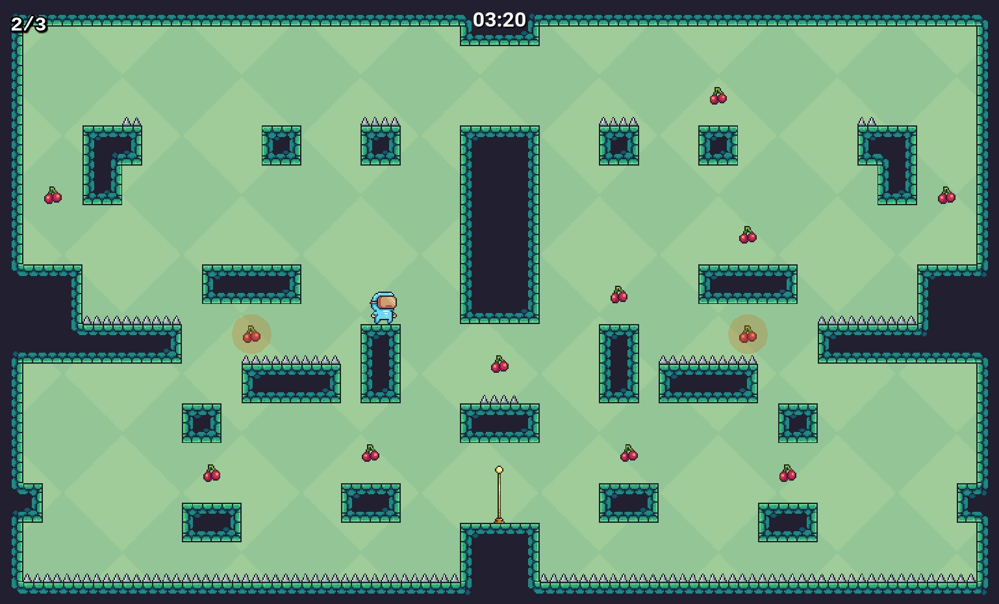
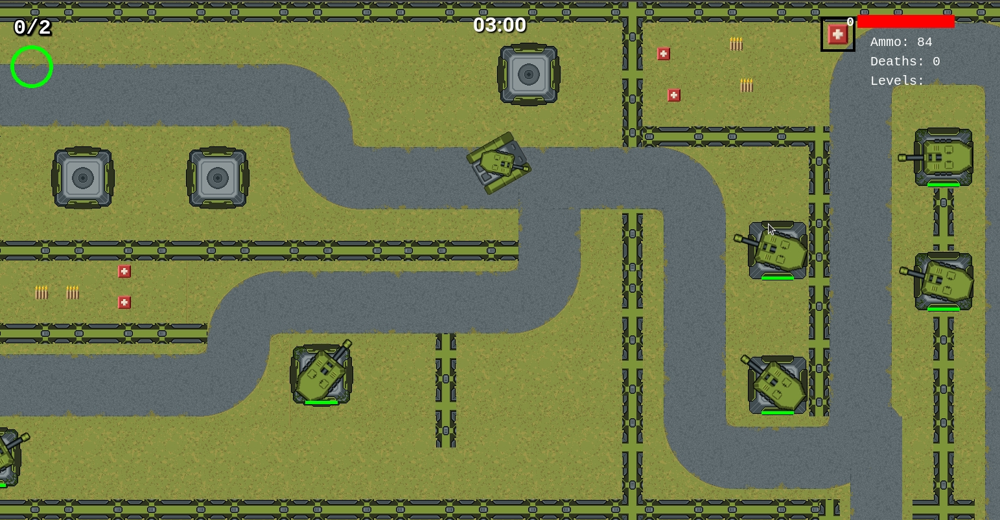
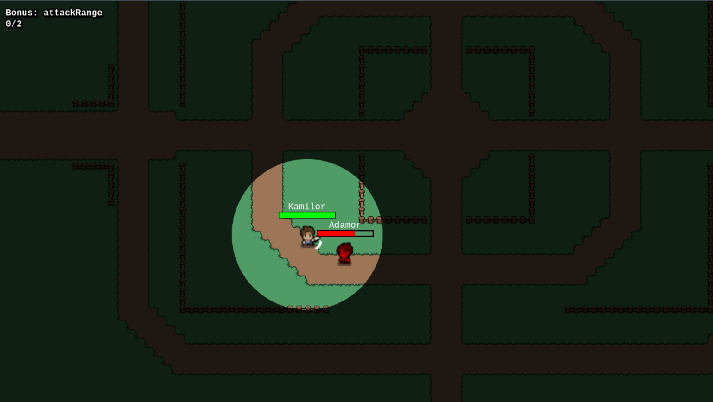
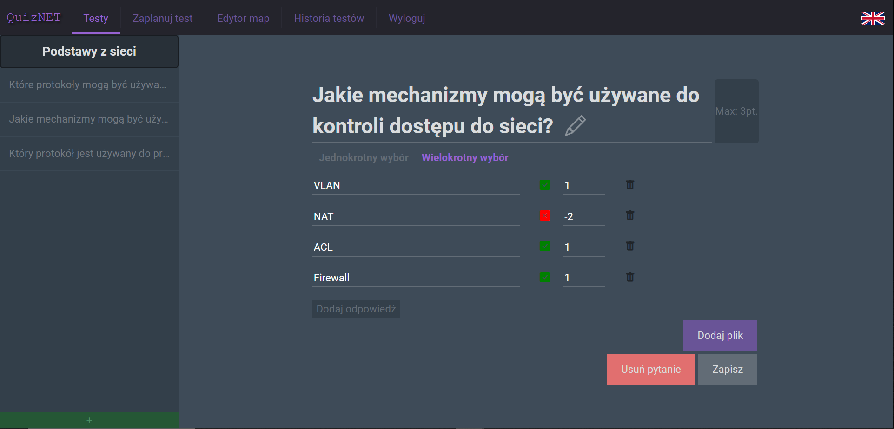
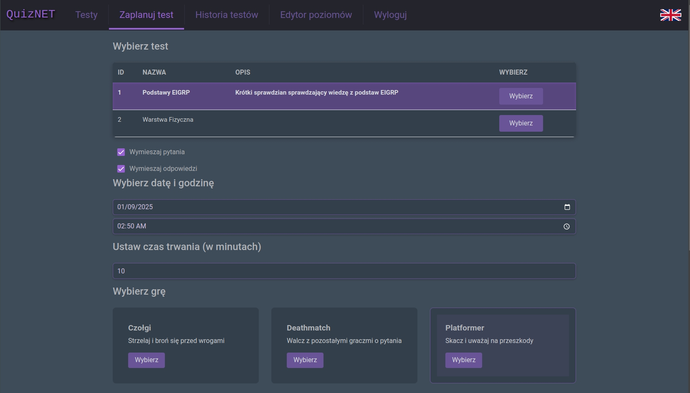
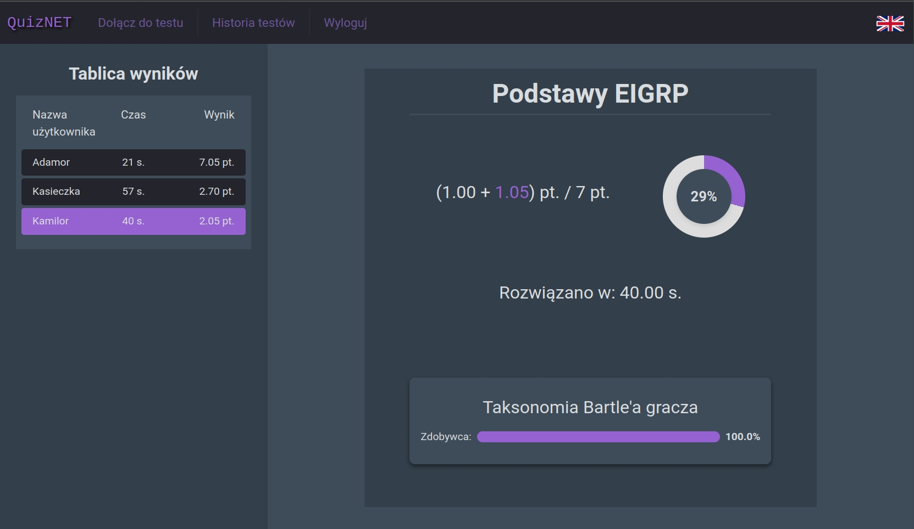
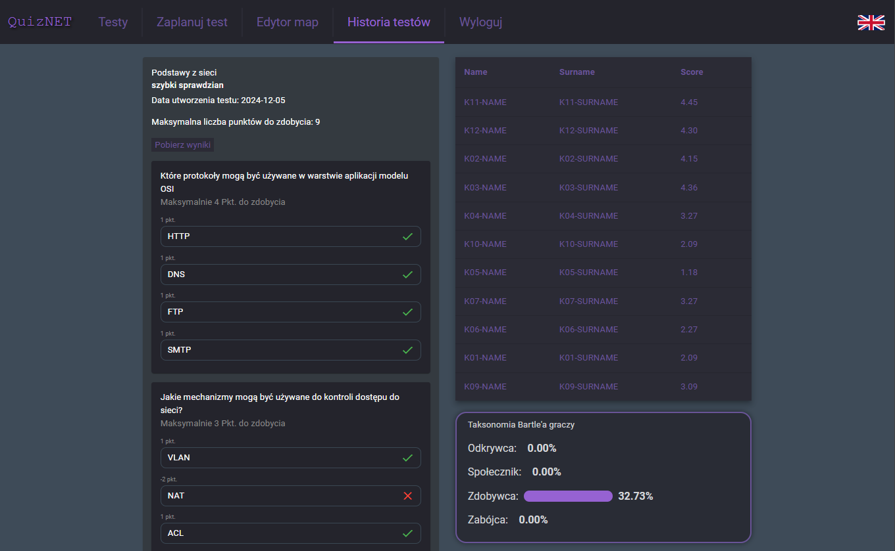

# QuizNET - Gamification of short knowledge assessments

## 📌: Project Overview
QuizNET is a full-stack web application that aims to transform traditional knowledge tests into gamified experience. The platform allows teachers to create and schedule tests that are enhanced with mini-games, making learning more engaging and motivating for students. 

Students complete tests with one of three integrated mini-games. The system also captures brief personality insights based on students' in-game decision (Bartle Taxonomy).

Teachers can monitor tests live, track student progress in real-time, and access detailed results and analytics for performance and behavioral patterns.

Project is made as part of Engineering Thesis.

## 🛠️ Tech Stack

**Frontend:** Angular (HTML, CSS, JS/TS), Bootstrap, Phaser

**Backend:** Node.js, Express.js, PostgreSQL, Docker, Javascript

## 🌟 Key features

- User registration & login (JWT-based auth)
- Role-based access (Teacher / Student)
- Test creation and scheduling
- Predefined games with various levels + creating own levels
- Gamified tests with three customizable mini-games
- Real-time score monitoring for Teacher
- Detailed result and analytics dashboard (scoreboard with anonymized names for Students)
- Personality insights based on in-game behavior
- Changing app language

## 📸 Screenshots

### Game: Platformer


### Game: Tanks


### Game: Deathmatch


### Test: Question Creator


### Test: Scheduling


### Test: Results [Student]


### Test: Results [Teacher]


## 📦 Installation & Setup (Linux)

### Installing tools (Node, NPM, Docker, Angular-CLI)
```bash
sudo apt update
sudo apt install -y nodejs npm

sudo apt install -y docker.io docker-compose-plugin
sudo systemctl enable docker
sudo systemctl start docker
sudo usermod -aG docker $USER

sudo npm install -g @angular/cli
```

### Clone repository
```bash
git clone https://github.com/Va-rx/Grywalizacja
cd Grywalizacja
```

### Install frontend dependencies & build project
```bash
cd web
npm install
ng build --configuration production
```

### Configure Environment Variables
Copy example:
```bash
cd backend
cp env.example .env
```
Set your own secret values (Especially JWT token)

### Create Database with Docker
```bash
#backend
docker compose up -d
```

### Install Dependencies
```bash
#backend
npm install
```

### Start App (Production)
Set NODE_ENV=production in .env
```bash
#backend (http://localhost:8080)
node server.js
```
Or run
```bash
#backend (http://localhost:8080)
NODE_ENV=production node server.js
```

### Start App (Development)
Set NODE_ENV=development in .env
```bash
#backend (http://localhost:8080)
node server.js

#web (http://localhost:4200)
ng serve --proxy-config proxy.conf.json --open
```
Or run
```bash
#backend (http://localhost:8080)
NODE_ENV=development node server.js

#web (http://localhost:4200)
ng serve --proxy-config proxy.conf.json --open
```

### Using the App
Students can create their own accounts using the registration form available in the application.

For demonstration purposes, a default administrator (teacher) account is provided.

**Default admin credentials:**

- Email: `admin@admin.pl`
- Password: `adminADMIN`

These credentials can be modified in the database initialization script:

```bash
./backend/dbInit/2filldata.sql
```

The password stored in `2filldata.sql` is already hashed.  
If you change the default password, make sure to generate a new bcrypt hash before updating the script.

## 🛃 Adding Levels

All implemented levels must be manually added using the in-app editor.  
Once added, they remain permanently available in the system.

All level files are located in:

```bash
./backend/dbInit/levels
```

This directory also contains instructions and suggestions on how to properly load the levels into the system.  
It includes predefined difficulty levels and suggested completion times (mainly for the Platformer game).

## 🔑 Game Configuration

### Deathmatch

- Number of levels: **1**

Levels in this game do not have a predefined time limit.  
The session ends either when:

- The overall test time expires
- The student answers all questions

### Tanks

- Number of levels: **1**

Levels in this game do not have a predefined time limit.  
The session ends either when:

- The overall test time expires
- The student answers all questions

The maximum number of questions per test is approximately **10**, due to the map length (each checkpoint represents one question).

A small bonus system exists (independent of the maximum test score), based on collected items:

- Collecting a hidden star increases tank damage.
- Medkits can be:
  - Used on yourself (`E`)
  - Transferred to a randomly selected weakened player (`F`)

### Platformer

- Number of levels: **8**

Each level has a suggested completion time.  
When the suggested time expires, a question appears, and the player progresses to the next level.

The maximum number of questions per test is **8**, since each level corresponds to one question.  
If additional levels are implemented, the question pool can be expanded accordingly.

When scheduling a test, the teacher must select **X levels**, where **X equals the number of questions in the test**.  
Otherwise, the test cannot be scheduled.

The order in which levels are selected determines the order in which they appear during gameplay.  
(Suggestion: start with easier levels.)

---

**Platformer Bonus System**

The Platformer game includes configurable bonus settings during test planning.

Available bonus categories:

- Collecting optional bonus fruits  
- Completing a level without dying  
- Completing a level within a fast time  

Bonuses are calculated as a percentage of the maximum possible test score.

---

**Example**

If a test is worth **20 points**:

Setting all bonuses to **20%** allows a theoretical maximum of:

- 4 + 4 + 4 bonus points  

These bonus points are **not included in the main test denominator**.

Important notes:

- Achieving all bonuses simultaneously on every level is highly unlikely.
- Bonuses often conflict (e.g., collecting fruits may negatively affect time or increase risk of death).
- The 20% value applies to the entire test, not per individual level.

For example:

Completing half of the levels without dying would grant **2 bonus points**.

"Fast completion" means finishing a level in less than **one-third of the suggested time**.

Suggested time values are configurable and can be adjusted when adding new levels.

---

**Notes on Specific Levels**

- **City level** – very difficult and experimental.
- **WeirdLevel** – contains hidden mechanics and secrets that require understanding non-obvious gameplay behavior.

## 🎓 Collaborators and responsibilities
### Jakub Płowiec
- Database structure + queries
- API endpoints
- Game Platformer
- Results exporter
- Views/pages:
  - List of tests (Implementation + Design)
  - Question creator (Implementation + Design)
  - Test creator (Implementation + Design)
  - Navigation Bar (Implementation + Design)
  - Login, Register (Design)
  - Question during Test (Design)
  - Results after Test (Design)

### Grzegorz Liana
- Server connection with Database
- Game Tanks
- Views/pages:
  - Test scheduler (Implementation + Design)
  - Test lobby (Implementation + Design)
  - Live results (Implementation + Design)
  - Results after Test (Implementation)

### Kacper Korta
- Database queries
- API endpoints
- Game Deathmatch
- Changing language
- Views/pages:
  - Login, Register (Implementation + Design)
  - List of finished Tests [Student] (Implementation + Design)
  - List of finished Tests [Teacher] (Implementation + Design)
  - Custom levels loader (Implementation + Design)

